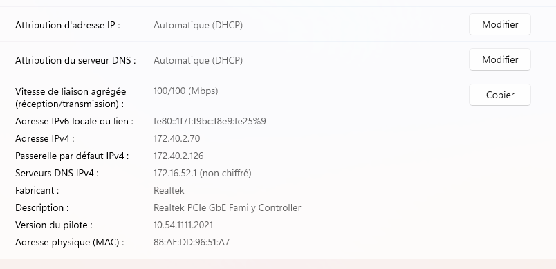
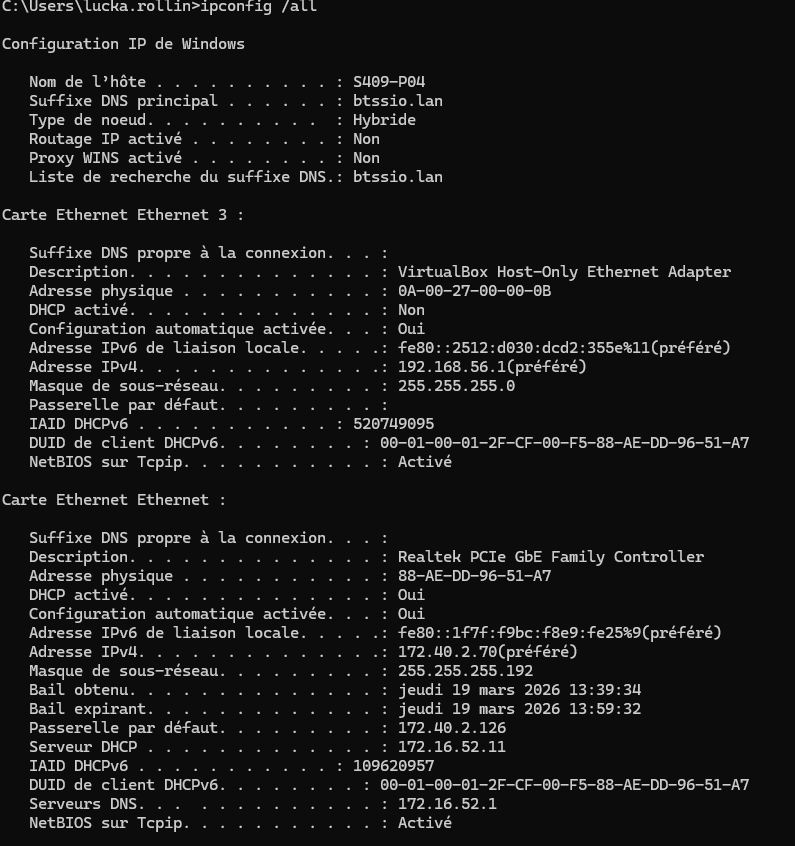

# FICHE DE RECETTE : VALIDATION DE LA MISSION 2

Ce document atteste du bon fonctionnement de la distribution dynamique des adresses IP sur l'infrastructure réelle (via le serveur Debian 13 et le relais DHCP du routeur Cisco).

## 1. CONTEXTE DU TEST

* **Machine Cliente testée :** Poste Windows 10/11 (Nom d'hôte : `S409-P04`)
* **VLAN cible simulé :** VLAN 40 (Réseau Logistique : `172.40.2.64/26`)
* **Serveur DHCP interrogé :** Serveur Linux MN11 (`172.16.52.11`) situé dans le VLAN 52 (Serveurs).

## 2. RÉSULTATS D'OBTENTION (PREUVES TECHNIQUES)

L'exécution de la commande `ipconfig /all` sur le poste client a retourné les valeurs suivantes, confirmant l'exactitude de la configuration du Pool DHCP et du relais IP :

* **Adresse IPv4 obtenue :** `172.40.2.70` (Correspond bien à la plage de début du VLAN 40)
* **Masque de sous-réseau :** `255.255.255.192` (Correspond bien au masque /26 du VLAN 40)
* **Passerelle par défaut :** `172.40.2.126` (Correspond bien à la sous-interface Gigabit du routeur pour le VLAN 40)
* **Serveur DHCP validé :** `172.16.52.11` (Le client a bien communiqué avec le serveur Debian MN11)
* **Serveur DNS distribué :** `172.16.52.1` (Correspond au futur serveur Windows MN01)

✅ <strong>Conclusion de l'analyse :</strong> 
L'agent de relais (`ip helper-address`) configuré sur le routeur Cisco est 100% fonctionnel. Les trames DHCP Discover traversent correctement le réseau depuis le VLAN 40 jusqu'au VLAN 52, et le serveur Debian attribue les bons baux correspondants aux sous-réseaux.

## 3. TABLEAU DE VALIDATION DES EXIGENCES

| ID Test | Exigence (Cahier des charges) | Résultat du Test | Statut |
| :--- | :--- | :--- | :---: |
| **REC-DHCP-01** | Attribution dynamique activée sur le client | La carte réseau est configurée en "Automatique (DHCP)". | VALIDÉ |
| **REC-DHCP-02** | Obtention d'une IP valide dans la bonne plage | IP `172.40.2.70` obtenue (Pool Logistique). | VALIDÉ |
| **REC-DHCP-03** | Distribution des options (Passerelle & DNS) | Gateway et DNS correctement configurés sur le poste. | VALIDÉ |
| **REC-DHCP-04** | Vérification du serveur bailleur | Le serveur identifié est bien MN11 (`172.16.52.11`). | VALIDÉ |
